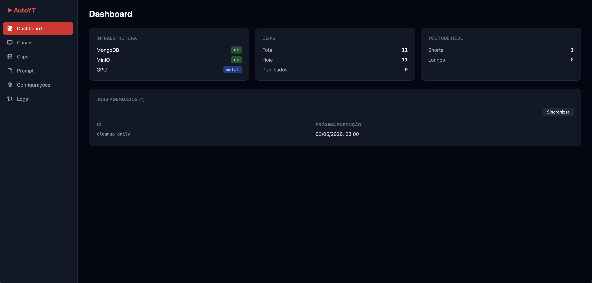
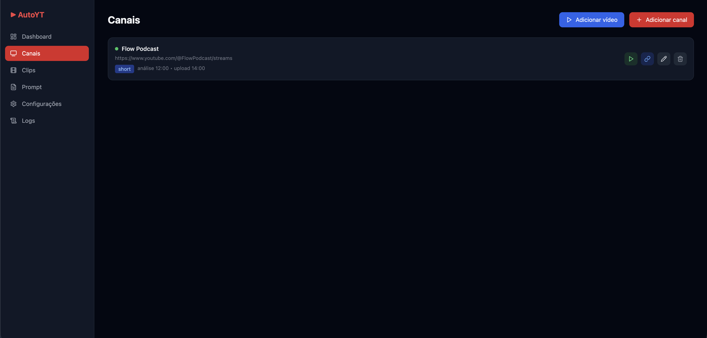
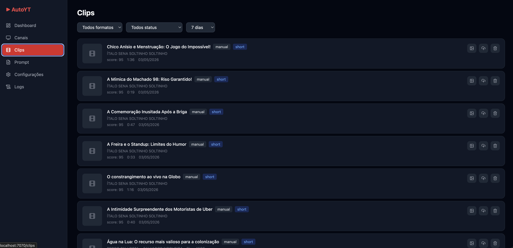
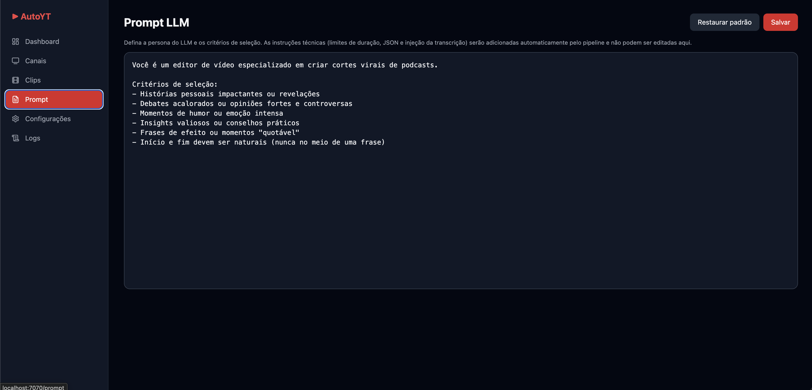
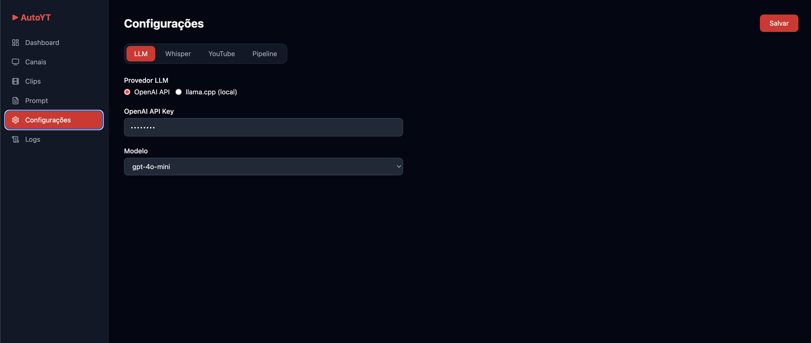
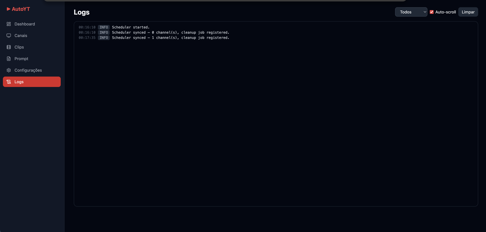

# AutoYT - Automação de Cortes para YouTube 🚀

AutoYT é uma solução completa e automatizada para transformar vídeos longos (podcasts, lives, vlogs) em cortes virais prontos para YouTube Shorts e vídeos longos. Utilizando Inteligência Artificial de ponta, o sistema analisa transcrições, identifica os melhores momentos, faz a edição automática com legendas e realiza o upload para o seu canal.

## ✨ Funcionalidades

- 🤖 **Análise por IA**: Utiliza OpenAI (GPT-4o) ou modelos locais (Llama-cpp) para identificar momentos virais, engraçados ou impactantes.
- 🗣️ **Transcrição Precisa**: Integração com OpenAI Whisper para gerar legendas sincronizadas palavra por palavra.
- 🎨 **Thumbnails com IA**: Geração automática de miniaturas impactantes usando DALL-E 3.
- 🎬 **Edição Automática**: Corte preciso de clipes e "burn-in" de legendas no vídeo usando FFmpeg.
- ☁️ **Armazenamento S3**: Integração total com MinIO/S3 para gestão de arquivos de vídeo e metadados.
- 📈 **Dashboard Web**: Interface moderna em React para gerenciar canais, editar prompts e monitorar o status dos clips.
- 📅 **Agendamento Inteligente**: Sistema de cron integrado para processar canais e realizar uploads diários automaticamente.
- 🔐 **OAuth2 Integrado**: Autorização simplificada do YouTube diretamente pelo navegador.
- 🌍 **Multi-idioma**: Suporte completo para Português (BR) e Inglês em toda a interface.

## 📸 Screenshots

Aqui estão algumas prévias da interface do AutoYT:

| Dashboard | Canais |
|:---:|:---:|
|  |  |

| Clips | Prompt LLM |
|:---:|:---:|
|  |  |

| Configurações | Logs |
|:---:|:---:|
|  |  |

## 🛠️ Tech Stack

- **Backend**: Python (FastAPI, Motor, MongoDB, APScheduler)
- **Frontend**: React (Vite, TypeScript, Tailwind CSS, Lucide Icons)
- **Processamento de Vídeo**: FFmpeg, yt-dlp
- **IA/ML**: OpenAI API, Whisper, Llama-cpp-python
- **Storage**: MinIO (S3 Compatible)

## 🚀 Como Começar

### Pré-requisitos
- Python 3.10+
- Node.js 18+
- Docker e Docker Compose (para Banco de Dados e Storage)
- FFmpeg instalado no sistema

### Instalação e Setup

1. Clone o repositório:
```bash
git clone https://github.com/israelfds/youtube-automation-share.git
cd youtube-automation-share
```

2. Execute o script de setup:
O script `setup.sh` irá configurar o ambiente virtual, instalar dependências de sistema, configurar o `.env`, buildar o frontend e subir os containers Docker necessários automaticamente.
```bash
chmod +x setup.sh
./setup.sh
```

3. Inicie a aplicação:
Após o setup, use o script de inicialização para subir o backend e o frontend:
```bash
chmod +x start.sh
./start.sh
```

4. Acesse o dashboard:
O sistema estará disponível em `http://localhost:7070`

## ⚙️ Configuração do Google Cloud (YouTube API)

Para habilitar o upload automático, você precisará de uma conta no Google Cloud Console:
1. Crie um projeto e ative a **YouTube Data API v3**.
2. Vá em **Credentials** e crie um **OAuth 2.0 Client ID** do tipo "Desktop App".
3. Adicione o Redirect URI: `http://localhost:7070/api/settings/youtube/callback`
4. Copie o Client ID e Client Secret para a aba **Configurações** no dashboard do AutoYT.

## 📄 Licença

Este projeto está sob a licença **MIT**. Veja o arquivo [LICENSE](LICENSE) para detalhes.

---
Desenvolvido por Israel Feitosa.
